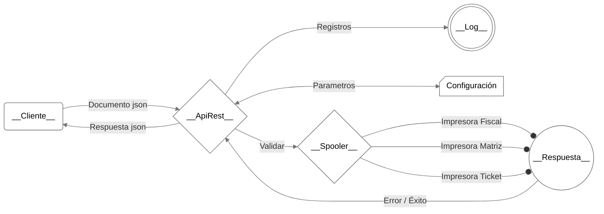

# Proyecto API y Spooler de Impresión
Copyright © 2024, Iron Graterol
Licensed under the GNU Affero General Public License, version 3 or later.


## Introducción

Proyecto que consiste en un **Servidor API REST** que actua como **Spooler de Impresoras** para la impresión de documentos fiscales y no fiscales:
- Facturas de Venta
- Notas de Crédito
- Notas de Débito
- Notas de Entrega
- Recibos de Entrega
- Tickets de Venta

## Tecnologías Utilizadas

- Python (flask, pywin32, pythonnet, pyserial, etc)
- JSON
- HTML, CSS, JS
- Librerías DLL y Propias

## Uso

### Ejemplo de Solicitud

El servidor API recibirá un json, que contendrá la siguiente estructura:

```json
{
  "operation_type": "invoice",           # TIPO DE OPERACIÓN (invoice, credit, debit, note)
  "affected_document": {                 # DOCUMENTO AFECTADO (PARA NOTAS DE CRÉDITO/DÉBITO)
    "affected_number": "00004-001-0002", # NÚMERO DEL DOCUMENTO AFECTADO
    "affected_date": "2022-01-01",       # FECHA DEL DOCUMENTO AFECTADO
    "affected_serial": "EOO9000001"      # SERIAL DEL DOCUMENTO AFECTADO
  },
  "customer": {                          # INFORMACIÓN DEL CLIENTE
    "customer_vat": "V131348076",        # RIF, CI, NIT, NIF
    "customer_name": "NOMBRE DEL CLIENTE",
    "customer_address": "DIRECCION DEL CLIENTE CIUDAD DEL CLIENTE PAIS DEL CLIENTE",
    "customer_phone": "02916419691",
    "customer_email": "cliente@example.com"  # CORREO DEL CLIENTE
  },
  "document": {                          # INFORMACIÓN DEL DOCUMENTO
    "document_number": "00004-001-0002", # NÚMERO DEL DOCUMENTO
    "document_date": "2022-01-01",       # FECHA DEL DOCUMENTO
    "document_name": "Shop/0001",        # NOMBRE DEL DOCUMENTO
    "document_cashier": "JUANITO"        # CAJERO/VENDEDOR
  },
  "items": [                             # LISTA DE ITEMS
    {
      "item_ref": "60-2005",             # CODIGO DEL PRODUCTO
      "item_name": "ACEITE REFRIGERANTE PAG-150 R134 AUTOM 8", # NOMBRE DEL PRODUCTO
      "item_quantity": 1,                # CANTIDAD DEL ITEM
      "item_price": 155.99,              # PRECIO DEL ITEM 
      "item_tax": 16,                    # IMPUESTO DEL ITEM (0, 12, 16, 8, 22, 31)
      "item_discount": 0,                # DESCUENTO DEL ITEM (Monto o Porcentaje)
      "item_discount_type": "discount_percentage",  # TIPO DE DESCUENTO
      "item_comment": "MARCA GENETRON"   # COMENTARIO DEL ITEM
    }
  ],
  "payments": [                          # LISTA DE PAGOS
    {
      "payment_method": "01",            # MÉTODO DE PAGO
      "payment_name": "EFECTIVO",        # NOMBRE DEL MÉTODO DE PAGO
      "payment_amount": 155.99           # MONTO DEL PAGO
    }
  ],
  "delivery": {                          # INFORMACIÓN DE ENTREGA
    "delivery_comments": [               # LISTA DE COMENTARIOS PARA ENTREGA
      "COMENTARIO 1",
      "COMENTARIO 2"
    ],
    "delivery_barcode": "150025-0002"    # CÓDIGO DE BARRAS O QR DE ENTREGA
  },
  "operation_metadata": {                # METADATOS DE LA OPERACIÓN
    "terminal_id": "T001",               # IDENTIFICADOR DEL TERMINAL
    "branch_code": "SUC001",             # CÓDIGO DE LA SUCURSAL
    "operator_id": "OP123"               # IDENTIFICADOR DEL OPERADOR
  }  
}
```

### Ejemplo de Respuesta

La API devolverá una respuesta al usuario con la siguiente estructura:

```json
{
  "status": true,                        # ESTADO DE LA OPERACIÓN (true=éxito, false=error)
  "message": "Documento procesado correctamente",  # MENSAJE DESCRIPTIVO
  "data": {
    "document_date": "2025-01-09",       # FECHA DEL DOCUMENTO IMPRESO
    "document_number": "00002515",       # NÚMERO DEL DOCUMENTO IMPRESO
    "machine_serial": "Z1B1234567",      # NÚMERO DE SERIE DE LA IMPRESORA
    "machine_report": "0015"             # NÚMERO DE REPORTE ASOCIADO A LA IMPRESORA
  }
}
```

**Notas sobre la respuesta:**

- Para impresoras fiscales: Los valores son obtenidos directamente de la impresora mediante comandos fiscales
- Para impresoras no fiscales: Los valores son generados dinámicamente siguiendo un formato predefinido
- El campo `message` contendrá detalles adicionales en caso de error

### Flujo de Procesos

El sistema puede operar en dos modos principales: **Spooler de Impresión** o **Servidor Proxy**. 
A continuación se detalla cada modo:

#### 1. Modo Spooler de Impresión

El servidor procesa directamente los documentos para impresión, soportando tres tipos de impresoras:

##### 1.1 Impresora Fiscal
- **Conexión:** Puerto serial (COM)
- **Modelos Soportados:**
    - TFHKA
    - PNP
    - RIGAZSA (en desarrollo)
    - BEMATECH (en desarrollo)
- **Características:**
    - Validación fiscal automática
    - Generación de números de control
    - Reportes X y Z
    - Respuesta con datos fiscales reales

##### 1.2 Impresora de Ticket

- **Conexión:** Puerto USB
- **Características:**
    - Comandos ESC/POS
    - Ancho máximo: 80mm
    - Soporte para:
        - Códigos de barras (1D/2D)
        - Logos personalizados
        - Formatos especiales
- **Respuesta:** Generación de identificadores únicos

##### 1.3 Impresora Matriz de Punto

- **Conexión:** Puerto USB o LPT
- **Modelos:** Compatible con EPSON (LX, FX)
- **Características:**
    - Comandos ESC/P
    - Formatos de papel:
        - CARTA
        - MEDIA_CARTA
    - Plantillas personalizables
- **Respuesta:** Generación de identificadores únicos

#### 2. Modo Servidor Proxy

Actúa como intermediario entre el cliente y otro servidor de impresión.

- **Funcionamiento:**
    1. Recibe solicitud del cliente
    2. Valida formato JSON
    3. Reenvía a servidor destino
    4. Espera respuesta
    5. Retransmite respuesta al cliente

- **Configuración Requerida:**
    - `proxy_enabled: true`
    - URL válida en `proxy_target`
    - Timeout configurable

- **Ventajas:**
    - Conexiones remotas
    - Redundancia
    - Centralización de equipos y servicios

## Diagrama de Arquitectura



## Estructura Actual del Proyecto

```
└── API/
    └── api_printer_server/
        ├── __init__.py
        ├── .gitignore
        ├── .pylintrc
        ├── LICENSE
        ├── main.py
        ├── pyproject.toml
        ├── README.md
        ├── requirements.txt
        └── setup.py
        └── config/                         # Archivos de configuración
        |   ├── config.json
        |   ├── config.md                   # Instrucciones de uso de los archivos json en esta sección
        |   ├── hka_flag_21.json
        |   ├── hka_max_char.json
        |   ├── pnp_functions.json
        |   └── pnp_max_char.json
        └── controllers/                    # Controladores para la lógica de impresión
        |   ├── __init__.py
        |   ├── pfhka.py                    # libreria en desarrollo para conexion serial a impresora TFHKA
        |   ├── pfpnp.py                    # libreria en desarrollo para conexion serial a impresora PNP
        |   ├── PnP.py                      # libreria experimental con conexion serial a impresora PNP
        |   └── TfhkaPyGD.py                # libreria funcional con conexion serial a impresora TFHKA
        └── docs/                           # Documentación del proyecto
        |   ├── ascii.md
        |   ├── project.md                  # Archivo Actual!!!
        |   └── prompt_refactor.md
        └── library/                        # Librerias DLL proporcionadas por los fabricantes de impresoras fiscales.    
        |   ├── pnpdll.dll
        |   └── TfhkaNet.dll
        └── logs/                           # Archivos de log
        └── models/                         # Modelos de datos
        |   ├── __init__.py
        |   └── model_invoice.py
        └── printers/                       # Lógica específica de las impresoras
        |   ├── __init__.py
        |   ├── printer_base.py
        |   ├── printer_commands.py
        |   ├── printer_counter.py
        |   ├── printer_dotmatrix.py
        |   ├── printer_hka.py
        |   ├── printer_pnp.py
        |   └── printer_ticket.py
        └── resources/                      # Recursos adicionales
        |   ├── block.svg
        |   ├── example.json
        |   └── printer_fiscal.ico
        └── server/                         # Implementación del servidor API
        |   ├── __init__.py
        |   ├── auth.py
        |   ├── config_loader.py        
        |   ├── document_schema.py
        |   ├── server_api.py
        |   └── handlers/                   # Manejador de documento y conexiones
        |       ├── __init__.py
        |       ├── document_handler.py
        |       ├── printer_manager.py
        |       └── proxy_handler.py
        └── templates/                      # Plantillas JSON
        |   ├── template_fiscal_printer.json
        |   ├── template_matriz_carta.json
        |   ├── template_ticket_simple.json
        |   └── templates.md                # Instrucciones de uso de los archivos json en esta sección
        └── tests/                          # Pruebas unitarias
        |   ├── run_proxy.bat
        |   ├── run_proxy.py
        |   └── run_spooler.bat
        └── utils/                          # Conjunto de herramientas
        |   ├── __init__.py
        |   ├── tools.py
        |   └── version.py
        └── views/                          # Archivos HTML y estáticos
            ├── config-editor.html
            ├── status.html
            └── static/
                ├── css/
                |   ├── config-editor.css
                |   └── styles.css
                └── js/
                    ├── config-editor.js
                    └── dashboard.js
```
