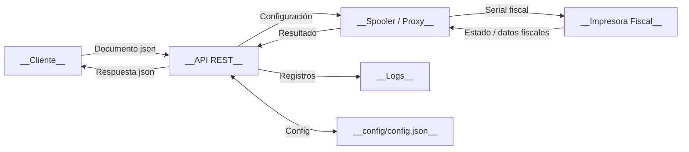

# Proyecto API y Spooler Fiscal
Copyright © 2024, Iron Graterol
Licensed under the GNU Affero General Public License, version 3 or later.

## Introducción

Proyecto basado en **Flask** que expone una **API REST** para operar un **spooler fiscal** o un **proxy fiscal**.

Esta rama del repositorio está dedicada únicamente a impresión fiscal. El alcance funcional actual cubre:

- Facturas
- Notas de crédito
- Notas de débito
- Notas o documentos de entrega emitidos por la impresora fiscal
- Reportes X y Z
- Comandos fiscales directos

## Tecnologías Utilizadas

- Python 3.10
- Flask y Flask-CORS
- `pyserial` para comunicación serial con la impresora fiscal
- `jsonschema` para validación de configuración
- HTML, CSS y JavaScript para dashboard y editor de configuración
- `watchdog`, `pystray` y `tkinter` para operación local del servicio

## Contrato de Entrada

### Ejemplo de Solicitud

La API recibe un JSON con la siguiente estructura general:

```json
{
  "operation_type": "invoice",
  "affected_document": {
    "affected_number": "00004-001-0002",
    "affected_date": "2022-01-01",
    "affected_serial": "EOO9000001"
  },
  "customer": {
    "customer_vat": "V131348076",
    "customer_name": "NOMBRE DEL CLIENTE",
    "customer_address": "DIRECCION DEL CLIENTE CIUDAD DEL CLIENTE PAIS DEL CLIENTE",
    "customer_phone": "02916419691",
    "customer_email": "cliente@example.com"
  },
  "document": {
    "document_number": "00004-001-0002",
    "document_date": "2022-01-01",
    "document_name": "Shop/0001",
    "document_cashier": "JUANITO"
  },
  "items": [
    {
      "item_ref": "60-2005",
      "item_name": "ACEITE REFRIGERANTE PAG-150 R134 AUTOM 8",
      "item_quantity": 1,
      "item_price": 155.99,
      "item_tax": 16,
      "item_discount": 0,
      "item_discount_type": "discount_percentage",
      "item_comment": "MARCA GENETRON"
    }
  ],
  "payments": [
    {
      "payment_method": "01",
      "payment_name": "EFECTIVO",
      "payment_amount": 155.99
    }
  ],
  "delivery": {
    "delivery_comments": [
      "COMENTARIO 1",
      "COMENTARIO 2"
    ],
    "delivery_barcode": "150025-0002"
  },
  "operation_metadata": {
    "terminal_id": "T001",
    "branch_code": "SUC001",
    "operator_id": "OP123"
  }
}
```

### Ejemplo de Respuesta

```json
{
  "status": true,
  "message": "Documento procesado correctamente",
  "data": {
    "document_date": "2025-01-09",
    "document_number": "00002515",
    "machine_serial": "Z1B1234567",
    "machine_report": "0015"
  }
}
```

### Notas sobre la respuesta

- Los valores de `data` provienen de la impresora fiscal o del parser fiscal correspondiente.
- `message` contiene detalles operativos o de error.
- El comportamiento exacto puede variar según el driver fiscal activo.

## Endpoints Principales

| Método | Ruta | Propósito |
|--------|------|-----------|
| `GET` | `/api/ping` | Verificación básica de disponibilidad |
| `GET` | `/api/status` | Estado del servicio y de la impresora fiscal |
| `POST` | `/api/printers` | Procesamiento de documento fiscal |
| `GET` | `/api/report_x` | Emisión de reporte X |
| `GET` | `/api/report_z` | Emisión de reporte Z |
| `POST` | `/api/command` | Envío de comandos fiscales directos |
| `POST` | `/api/config` | Guardado de configuración |
| `POST` | `/api/auth/validate` | Validación del código de seguridad |

## Modos de Operación

### 1. Modo SPOOLER

Procesa directamente el documento sobre la impresora fiscal conectada al equipo.

- **Conexión**: puerto serial (`COM`, `/dev/ttyACM*`, `/dev/ttyUSB*`)
- **Drivers soportados**:
  - `TFHKA`
  - `PNP`

#### Capacidades fiscales relevantes

- Validación fiscal y control de estado del equipo
- Reportes X y Z
- Interpretación de estados y errores por driver
- Dirección multilínea para encabezado fiscal (`partner_address_lines`)
- Footer fiscal extendido con comentarios de entrega, correo de operador y tasa de cambio cuando aplica

> En impresoras TFHKA, los campos del encabezado usan índices dinámicos `i00` a `i09`. Mientras más líneas de dirección se activen, menos espacio queda para teléfono, email y metadatos del documento.

### 2. Modo PROXY

Actúa como intermediario y reenvía la solicitud a otro spooler fiscal.

- Recibe la petición del cliente
- Valida formato general
- Reenvía al `proxy_target`
- Espera la respuesta del spooler remoto
- Devuelve el resultado al cliente original

## Capa de Idempotencia (Job Store)

El spooler incorpora una capa de deduplicación que evita imprimir el mismo documento dos veces ante solicitudes repetidas de Odoo (doble clic, reintentos de red, pestañas múltiples).

### Mecanismo

- La clave de idempotencia es `(document_number, operation_type)`, donde `document_number` corresponde al ID interno del registro en Odoo.
- Los trabajos se persisten en una base SQLite en `data/print_jobs.db`.
- El acceso es atómico: `threading.Lock` + restricción `UNIQUE` en la tabla.

### Estados de un trabajo

| Estado | Significado | Acción del spooler |
|---|---|---|
| `processing` | En curso | Rechaza el duplicado con HTTP 409 |
| `completed` | Exitoso | Retorna la respuesta cacheada sin tocar la impresora |
| `failed` | Error previo | Autoriza el reintento y procesa nuevamente |

### Alcance

La idempotencia aplica únicamente a `POST /api/printers`. Los reportes X y Z no tienen `document_id` y no están cubiertos.

---

## Flujo de Procesamiento

1. El cliente envía el documento a la API.
2. El servidor valida el payload y carga la configuración activa.
3. Si el modo es `PROXY`, la solicitud se reenvía.
4. Si el modo es `SPOOLER`, `document_handler.py` resuelve la impresora fiscal activa.
5. **`job_store.py` evalúa la idempotencia**: si el documento ya fue procesado exitosamente, devuelve la respuesta cacheada y termina el flujo.
6. `printer_manager.py` instancia o reutiliza el driver fiscal correspondiente.
7. El driver fiscal procesa el documento y devuelve el resultado.
8. `job_store.py` registra el resultado (`completed` o `failed`).
9. La API responde con estado, mensaje y datos fiscales relevantes.

## Diagrama de Arquitectura


```mermaid
flowchart LR
    A["__Cliente__"] -- Documento json --> B["__API REST__"]
    B -- Respuesta json --> A
    B -- Configuración --> C["__Spooler / Proxy__"]
    C -- Serial fiscal --> D["__Impresora Fiscal__"]
    D -- Estado / datos fiscales --> C
    C -- Resultado --> B
    B -- Registros --> E["__Logs__"]
    B <-- Config --> F["__config/config.json__"]
```
