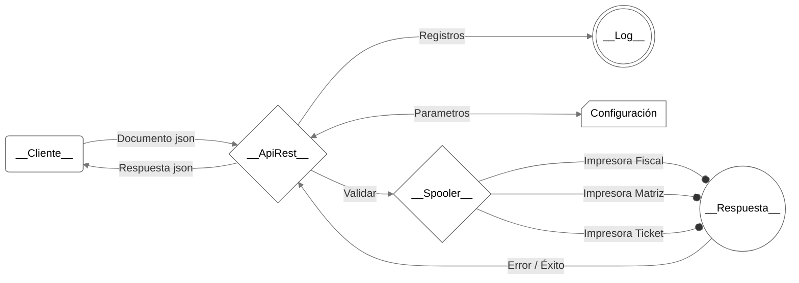

# Proyecto API y Spooler de Impresión
Copyright © 2024, Iron Graterol
Licensed under the GNU Affero General Public License, version 3 or later.


## Introducción

Proyecto que consiste en un **Servidor API REST** que actua como **Spooler de Impresoras** para la impresión de documentos fiscales y no fiscales:
- Facturas de Venta
- Notas de Crédito
- Notas de Débito
- Notas de Entrega
- Recibos de Entrega
- Tickets de Venta

## Tecnologías Utilizadas

- Python (flask, pywin32, pythonnet, pyserial, etc)
- JSON
- HTML, CSS, JS
- Librerías DLL y Propias

## Uso

### Ejemplo de Solicitud

El servidor API recibirá un json, que contendrá la siguiente estructura:

```json
{
  "operation_type": "invoice",           # TIPO DE OPERACIÓN (invoice, credit, debit; Odoo no envía note)
  "affected_document": {                 # DOCUMENTO AFECTADO (PARA NOTAS DE CRÉDITO/DÉBITO)
    "affected_number": "00004-001-0002", # NÚMERO DEL DOCUMENTO AFECTADO
    "affected_date": "2022-01-01",       # FECHA DEL DOCUMENTO AFECTADO
    "affected_serial": "EOO9000001"      # SERIAL DEL DOCUMENTO AFECTADO
  },
  "customer": {                          # INFORMACIÓN DEL CLIENTE
    "customer_vat": "V131348076",        # RIF, CI, NIT, NIF
    "customer_name": "NOMBRE DEL CLIENTE",
    "customer_address": "DIRECCION DEL CLIENTE CIUDAD DEL CLIENTE PAIS DEL CLIENTE",
    "customer_phone": "02916419691",
    "customer_email": "cliente@example.com"  # CORREO DEL CLIENTE
  },
  "document": {                          # INFORMACIÓN DEL DOCUMENTO
    "document_number": "0000000042",     # CLAVE DE IDEMPOTENCIA (id de Odoo, no se imprime)
    "document_date": "2022-01-01",       # FECHA DEL DOCUMENTO
    "document_name": "Shop/0001",        # NOMBRE DEL DOCUMENTO
    "document_cashier": "JUANITO"        # CAJERO/VENDEDOR
  },
  "items": [                             # LISTA DE ITEMS
    {
      "item_ref": "60-2005",             # CODIGO DEL PRODUCTO
      "item_name": "ACEITE REFRIGERANTE PAG-150 R134 AUTOM 8", # NOMBRE DEL PRODUCTO
      "item_quantity": 1,                # CANTIDAD DEL ITEM
      "item_price": 155.99,              # PRECIO DEL ITEM 
      "item_tax": 16,                    # IMPUESTO DEL ITEM (0, 8, 16, 31)
      "item_discount": 0,                # DESCUENTO DEL ITEM (Monto o Porcentaje)
      "item_discount_type": "discount_percentage",  # TIPO DE DESCUENTO
      "item_comment": "MARCA GENETRON"   # COMENTARIO DEL ITEM
    }
  ],
  "payments": [                          # LISTA DE PAGOS
    {
      "payment_method": "01",            # MÉTODO DE PAGO
      "payment_name": "EFECTIVO",        # NOMBRE DEL MÉTODO DE PAGO
      "payment_amount": 155.99           # MONTO DEL PAGO (Bs; divisa bruta con IGTF)
    }
  ],
  "delivery": {                          # INFORMACIÓN DE ENTREGA
    "delivery_comments": [               # LISTA DE COMENTARIOS PARA ENTREGA
      "COMENTARIO 1",
      "COMENTARIO 2"
    ],
    "delivery_barcode": "150025-0002"    # CÓDIGO DE BARRAS O QR DE ENTREGA
  },
  "operation_metadata": {                # METADATOS DE LA OPERACIÓN
    "terminal_id": "T001",               # IDENTIFICADOR DEL TERMINAL
    "branch_code": "SUC001",             # CÓDIGO DE LA SUCURSAL
    "operator_id": "OP123"               # IDENTIFICADOR DEL OPERADOR
  }  
}
```

### Ejemplo de Respuesta

La API devolverá una respuesta al usuario con la siguiente estructura:

```json
{
  "status": true,                        # ESTADO DE LA OPERACIÓN (true=éxito, false=error)
  "message": "Documento procesado correctamente",  # MENSAJE DESCRIPTIVO
  "data": {
    "document_date": "2025-01-09",       # FECHA DEL DOCUMENTO IMPRESO
    "document_number": "00002515",       # NÚMERO DEL DOCUMENTO IMPRESO
    "machine_serial": "Z1B1234567",      # NÚMERO DE SERIE DE LA IMPRESORA
    "machine_report": "0015",            # NÚMERO DE REPORTE ASOCIADO A LA IMPRESORA
    "total": 155.99                      # TOTAL IMPRESO POR LA MÁQUINA (incluye IGTF)
  }
}
```

**Notas sobre la respuesta:**

- Para impresoras fiscales: Los valores son obtenidos directamente de la impresora mediante comandos fiscales
- Para impresoras no fiscales: Los valores son generados dinámicamente siguiendo un formato predefinido
- El campo `message` contendrá detalles adicionales en caso de error; en una falla `data` siempre incluye `Estado` y `Error`
- Ver la sección [Contrato con Odoo](#contrato-con-odoo) para el detalle de éxito, falla y casos especiales

### Flujo de Procesos

El sistema puede operar en dos modos principales: **Spooler de Impresión** o **Servidor Proxy**. 
A continuación se detalla cada modo:

#### 1. Modo Spooler de Impresión

El servidor procesa directamente los documentos para impresión, soportando tres tipos de impresoras:

##### 1.1 Impresora Fiscal
- **Conexión:** Puerto serial (COM)
- **Modelos Soportados:**
    - TFHKA (ver [manual propio](manuales_propios/HKA80.md))
    - PNP
    - RIGAZSA (en desarrollo)
    - BEMATECH (en desarrollo)
- **Características:**
    - Validación fiscal automática
    - Generación de números de control
    - Reportes X y Z
    - Respuesta con datos fiscales reales
    - **Dirección multilínea**: La dirección del cliente puede ocupar múltiples líneas (1-4) con word-wrap automático a 40 caracteres por línea. La asignación de índices (i00-i09) es dinámica según la configuración.

> **Nota sobre multilínea**: En impresoras TFHKA, los campos del encabezado usan índices dinámicos i00-i09. Mientras más líneas de dirección se configuren (`partner_address_lines`), menos espacio queda para teléfono, email y datos del documento.
>
> **Footer**: El pie de página incluye línea divisoria (i00 con 30 guiones), email del operador (i08), tasa de cambio (i09) y delivery comments (i01-i07).

##### 1.2 Impresora de Ticket

- **Conexión:** Puerto USB (ver [manual propio](manuales_propios/POS80.md))
- **Características:**
    - Comandos ESC/POS
    - Ancho máximo: 80mm
    - Soporte para:
        - Códigos de barras (1D/2D)
        - Logos personalizados
        - Formatos especiales
- **Respuesta:** Generación de identificadores únicos
- **Contador:** emulado en SQLite (tabla `counters`, fila `ticket`); ver `templates/templates.md`

##### 1.3 Impresora Matriz de Punto

- **Conexión:** Puerto USB o LPT (ver [manual propio](manuales_propios/LX350.md))
- **Modelos:** Compatible con EPSON (LX, FX)
- **Características:**
    - Comandos ESC/P
    - Formatos de papel:
        - CARTA
        - MEDIA_CARTA
    - Plantillas personalizables
- **Respuesta:** Generación de identificadores únicos
- **Contador:** emulado en SQLite (tabla `counters`, fila `matrix`); ver `templates/templates.md`

#### 2. Modo Servidor Proxy

Actúa como intermediario entre el cliente y otro servidor de impresión.

- **Funcionamiento:**
    1. Recibe solicitud del cliente
    2. Valida formato JSON
    3. Reenvía a servidor destino
    4. Espera respuesta
    5. Retransmite respuesta al cliente

- **Configuración Requerida:**
    - `proxy_enabled: true`
    - URL válida en `proxy_target`
    - Timeout configurable

- **Ventajas:**
    - Conexiones remotas
    - Redundancia
    - Centralización de equipos y servicios

## Contrato con Odoo

El spooler se adapta al contrato de integración con Odoo (`rx2_localization`). Quien llama es el **navegador** del
usuario (formulario de factura o punto de venta), no el servidor de Odoo: envía el JSON con `fetch` y reenvía la
respuesta a Odoo. Por eso se requiere CORS y un Odoo con `https` no puede llamar a un spooler `http`.

### Solicitud (`POST /api/printers`)

- `operation_type`: `invoice`, `credit` o `debit`. (`note` sigue aceptado por el spooler, pero Odoo no lo envía.)
- `document.document_number`: id del registro de Odoo con ceros a la izquierda (10 dígitos). Es la **clave de
  idempotencia** y **nunca se imprime** como número del documento; el número fiscal lo asigna la máquina.
  `document.document_name` se imprime como referencia (`REF:`).
- **Todos los montos van en Bs**, aun si el documento está en otra moneda. `item_price` es unitario, **sin
  impuesto**; `item_quantity` admite 3 decimales; `item_discount` es siempre un porcentaje, con
  `item_discount_type` = `discount_percentage` o `surcharge_percentage` (descuento negativo).
- `item_tax` es el porcentaje (`0`, `8`, `16`, `31`); cualquier otra tasa se rechaza con HTTP 400.
- `payments[]`: `payment_method` (código de 2 dígitos configurado en Odoo), `payment_name`, `payment_amount`.
  Los pagos en **divisa** llegan **brutos: monto liquidado más su IGTF**, y la suma de pagos es igual a
  `total de ítems + IGTF`. Los códigos de divisa deben ser 20-24 y el IGTF de la máquina debe coincidir con el de la
  empresa (3 %). El flag 50 de la HKA debe estar activo.
- Notas de crédito y débito llevan `affected_document` (`affected_number` = número fiscal del documento origen,
  `affected_date`, `affected_serial`). Los importes de las notas son positivos.
- Claves adicionales que Odoo envía: `doc_reference`, `operation_metadata.currency_code`, `exchange_rate`,
  `inverse_rate`.

Reintento: Odoo no reintenta solo; el usuario repite la operación con el **mismo `document_number`** y el spooler
responde desde su almacén de trabajos sin imprimir de nuevo (ver [Idempotencia y recuperación](#idempotencia-y-recuperación)).

### Respuesta

Éxito (Odoo exige `status === true` booleano y `data.document_number` no vacío, que es el número fiscal):

```json
{
  "status": true,
  "message": "Documento procesado correctamente",
  "data": {
    "document_number": "00000123",
    "machine_serial": "Z7C0000000",
    "machine_report": "0045",
    "document_date": "2026-10-09",
    "total": 4120.0
  }
}
```

- `data.total` es el **total realmente impreso por la máquina, incluido el IGTF**. Odoo lo guarda y calcula la
  diferencia con su propio total (informativa, no bloquea). HKA lo devuelve; PNP queda pendiente (ver
  [Pendientes](#pendientes)).
- `data.machine_serial` se compara con el serial del diario; si no coincide es solo una advertencia en documentos,
  pero **bloquea los reportes** (`/api/ping`).

Falla: `status` es siempre booleano `false` y `data` siempre incluye `Estado` y `Error`, que Odoo guarda junto con
`message`. Si la causa real está en la impresora (tapa abierta, sin papel), se lee su estado actual y se informa:

```json
{
  "status": false,
  "message": "Impresora no disponible - Estado: En modo fiscal y en espera, Error: Error mecánico en la entrega de papel",
  "data": {"Estado": "En modo fiscal y en espera", "Error": "Error mecánico en la entrega de papel"}
}
```

Casos especiales:

| Caso | Respuesta |
|---|---|
| **Impreso sin número** (PNP con respuesta de cierre corta) | `status: false`, `Estado` = "Documento impreso". El trabajo queda `completed` para que un reintento **no reimprima**; no se inventa un número fiscal. |
| **Resultado desconocido** (no se pudo verificar si la máquina emitió) | HTTP 400, `status: false`, `Estado` = "Resultado desconocido". El documento debe verificarse en la máquina antes de reintentar. |
| **Ocupado** (trabajo en `processing`) | HTTP 409. Odoo mantiene el documento pendiente y el usuario reintenta luego. |

Odoo no inspecciona el código HTTP salvo el 409: cualquier cuerpo JSON se toma como respuesta; un cuerpo no JSON, un
error de red o un tiempo agotado (90 s para documentos, 10 s para `/api/ping`) dejan el documento pendiente.

### Otros endpoints usados por Odoo

| Endpoint | Uso |
|---|---|
| `GET /api/ping` | Antes de cada reporte. Devuelve `{"status": "success", "message": "<serial>"}` (aquí `status` es texto). El serial se lee de la máquina (HKA `S5`, PNP versión) sin cancelar ni crear instancias; si falla, usa el configurado. |
| `GET /api/report_x`, `GET /api/report_z` | Reporte X y cierre Z. Éxito: `data.status === true`; texto en `message`. |
| `POST /api/command` | `{"commands": ["<cmd>"]}`, un comando por llamada: Z por número (`RZ`) o fecha (`Rz`), reimpresión por número (`R<F\|C\|D\|S\|Z\|@>`) o por fecha, y `RU00000000000000` (último documento). Devuelve `status: false` y la lista de rechazados si la impresora rechaza el comando. |

Odoo restringe Z y reimpresiones a su grupo de gerentes fiscales; el spooler no tiene autenticación.

### CORS

Se configura solo en `config/config.json` (`server.allowed_origins`, lista de expresiones regulares; ver
`config/config.md`). Sin configuración se usan valores seguros por defecto (localhost, red privada y `*.odoo.com`).

### Diario de notas

La impresora matriz corre como otra instancia del spooler (otro puerto) y se configura en Odoo como un diario más.
El payload es idéntico al de una factura y la respuesta tiene la misma forma (número y serial).

### Diferencias del contrato (§6) y su estado

| # | Diferencia | Tratamiento actual |
|---|---|---|
| 1 | `operation_type` `note` documentado pero Odoo no lo envía | Sin cambio: el spooler lo sigue aceptando. |
| 2 | `document_number` es la clave de idempotencia de 10 dígitos, no un número fiscal | Se usa como clave del almacén de trabajos y no se imprime; matriz y tiquera imprimen su contador y `REF: <document_name>` (`3a147c2`, `f1cc37b`). |
| 3 | Claves no documentadas (`doc_reference`, `currency_code`, `exchange_rate`, `inverse_rate`) | Documentadas arriba; el esquema las admite. |
| 4 | `item_tax` es un porcentaje, no una letra | El modelo acepta solo 0, 8, 16 y 31 (se eliminó el 12 heredado, `7a468b1`); la nota de débito HKA al 31 % envía `` `3 `` (`0b4140f`). |
| 5 | `item_discount` siempre en porcentaje; existe `surcharge_percentage` | Documentado; PNP aplica descuentos y recargos al precio unitario (`cd6e53b`). |
| 6 | `item_quantity` con 3 decimales; `item_price` sin impuesto | Documentado; sin cambio de código. |
| 7 | Falta `data.total` | HKA: devuelve el total impreso con IGTF (`f40d5fc`). PNP: **pendiente** (ver Pendientes). |
| 8 | Odoo lee `data.Estado` y `data.Error` | Toda falla incluye ambos (`8c562d4`); `status` siempre booleano. |
| 9 | Semántica de HTTP 409 y CORS/OPTIONS no documentadas | Documentadas en esta sección; CORS por configuración. |
| 10 | `/api/ping`, `/api/report_*` y `/api/command` no descritos | Descritos arriba; el serial del ping es ahora el real (`2bd8ffb`) y `/api/command` informa los rechazos (`329aa5e`). |
| 11 | Flag 5001, códigos de divisa 20-24 y % de IGTF se configuran en la máquina | Es configuración de la máquina y de Odoo; el `199` de cierre se envía siempre con flag 50 = 01 (obligatorio según el manual). |
| 12 | `payment_name` sin truncar en Odoo | Pendiente de revisión por impresora; mantener nombres cortos (el manual limita a unos 14 caracteres). |

Otras correcciones relacionadas: tasas del contrato validadas (`ab9fd0a`), método de pago normalizado en el payload
crudo (`ab9fd0a`), PNP lee el número fiscal solo de respuestas de cierre y rechaza respuestas `ERROR` (`82ea995`).

## Idempotencia y recuperación

El almacén de trabajos (`data/print_jobs.db`, SQLite) garantiza que un documento no se imprima dos veces. La clave es
`(document_id, operation_type)`. Estados:

| Estado | Significado | Efecto de un reintento |
|---|---|---|
| `processing` | Hay una impresión en curso | HTTP 409 (ocupado). Si supera **180 s** sin actualizarse se considera huérfano (proceso interrumpido) y pasa a `unknown`. |
| `completed` | Documento emitido; se guarda la respuesta | Se devuelve la misma respuesta sin imprimir (0 tramas a la máquina). |
| `failed` | La impresión falló sin emitir el documento | Se permite reintentar. |
| `unknown` | No se sabe si la máquina emitió el documento | Se concilia con el contador de la máquina antes de decidir. |

Garantías del manejador (`server/handlers/document_handler.py`):

- Una excepción después de `acquire_job` nunca deja el trabajo en `processing`: pasa a `failed` (`cfc6c96`).
- Si el documento ya se imprimió, no se marca como fallido aunque no se pueda registrar: se responde éxito para que
  Odoo guarde el número fiscal.
- Las actualizaciones del trabajo están serializadas por un candado y las conexiones SQLite se cierran siempre
  (`38df325`).

### Conciliación con el contador de la máquina (HKA, `981e751`)

Antes de imprimir se guarda `counter_before` (contador del tipo de documento en `S1`). Ante una falla del driver, un
trabajo `unknown` o un huérfano, se lee el contador actual (`after`) y se decide:

- `after == before + 1` y ningún otro documento del mismo tipo completado desde entonces: el documento **sí se
  emitió**. Se responde éxito con el número, serial, reporte y fecha leídos de la máquina, sin reimprimir.
- `after == before`: **no se emitió**; el trabajo se reabre y se imprime normalmente.
- Cualquier otro caso (sin lectura, saltos, documentos intermedios, valores no numéricos): resultado `unknown`.
  **Ante la duda nunca se reimprime**; se responde "Resultado desconocido" para verificar en la máquina.

Motivo: con el USB cortado justo después del cierre, la máquina emitió la factura mientras el spooler veía un error.

**PNP no se concilia todavía**: conserva el comportamiento anterior (ver [Pendientes](#pendientes)). Otros detalles de
PNP: según el manual (pág. 9), ante un corte de energía la máquina cancela la factura abierta si aún no se había
enviado el cierre, y la completa si ya se había enviado. No verificado en hardware.

## Comportamiento por impresora

Resumen; el detalle verificado está en los manuales propios.

| Impresora | Tipo | Resumen | Manual |
|---|---|---|---|
| TFHKA (HKA80) | Fiscal, serial | USB CDC-ACM, 9600 8E1. `data.total` = campo 2 de `S2` leído tras el último pago y antes del `199`. El `199` es obligatorio con flag 50 = 01. Cancelar un documento consume un número fiscal. El documento abierto sobrevive a un corte de energía. Conciliación por contador activa. | [HKA80](manuales_propios/HKA80.md) |
| PNP | Fiscal, serial | Descuentos y recargos aplicados al precio unitario. El número fiscal se lee solo de la respuesta de cierre; si es corta, se responde "impreso sin número". Sin conciliación, sin `data.total` y sin comandos `R...` (equivalente `0xBA`) todavía. | Manual del fabricante en `docs/manuales/` |
| Matriz (Epson LX-350) | No fiscal, ESC/P | PC850 con `ESC ( t` + `ESC t 1`; página carta con `ESC C 0 11`; contador local reservado bajo candado; modo archivo en cualquier sistema operativo. | [LX350](manuales_propios/LX350.md) |
| Tiquera (POS80) | No fiscal, ESC/POS | PC850 con `ESC t 2` y codificación CP850; totales con el modelo; código de barras opcional. | [POS80](manuales_propios/POS80.md) |

Reglas de seguridad para pruebas con una máquina fiscal real: nunca emitir un reporte Z en producción, usar solo
documentos de valor mínimo y anular todo documento de prueba con una nota de crédito. Detalle en
[HKA80](manuales_propios/HKA80.md#0-reglas-de-seguridad-máquina-en-producción).

## Monitor fiscal (TFHKA)

Vista de solo lectura para el contador, en el panel web (`GET /`, sección "Monitor fiscal") y como JSON en
`GET /api/monitor` (`?refresh=1` fuerza una lectura). No imprime nada.

| Bloque | Contenido | Fuente en la máquina |
|---|---|---|
| Pre-cierre del Z | Próximo Z, último Z, ventas / notas de crédito / notas de débito por tasa (exento, base, IVA), neto del día | `U0X` (extracción del reporte X sin imprimir) |
| Contadores | Últimos números de factura, NC, ND y no fiscal; documentos del día; cierres Z | `U0X`, `S1` |
| Medios de pago | Acumulados del día por código (01-19 moneda nacional, 20-24 divisa), netos de notas de crédito | `S4` |
| Máquina | Modelo, serial, memoria de auditoría, tasas, flags, diferencia de reloj con el servidor | `SV`, `S5`, `S3`, `S1` |

- **Caché en el servidor**: la máquina se lee como máximo cada 60 s (forzado: cada 10 s) y **nunca durante una
  impresión**; todos los visitantes ven la misma lectura con su hora.
- Sin acumulados de IGTF: con el flag 63 = `00` la máquina no los incluye en `U0X` (cambiar el flag alteraría las
  respuestas de `S1`/`S2` que usa el driver).
- Solo TFHKA; para otras impresoras responde "no disponible".
- Archivos del panel servidos localmente (`views/static/vendor/`: Bootstrap 5.3.0, Chart.js 4.4.1): funciona sin
  internet.

### Ajuste automático del reloj

La máquina solo acepta ajustar la hora (`PF` HHMMSS) y la fecha (`PG` DDMMAA) **justo después de un reporte Z**
(manual v8.5.0, Tabla 18). Tras cada Z exitoso (`/api/report_z` o un comando `I?Z`), si el reloj de la máquina
difiere más de 2 minutos del servidor (sincronizado por NTP), el spooler lo ajusta y lo verifica con `S1`; el
resultado se informa como `clock_sync` y nunca convierte un Z exitoso en error. Ajuste manual: `POST /api/fiscal/clock`
o el botón "Ajustar reloj de la impresora" en la pestaña Comandos de la ventana (protegida por código). Pendiente de
verificar en hardware tras un Z real.

## Pendientes

- **Probar en Windows antes del despliegue**: el controlador TFHKA abre el puerto sin XON/XOFF (medido en HKA80 bajo
  Linux: con XON/XOFF se perdía el byte LRC en 11 de 500 lecturas `S1`; sin él, 0 de 500). Verificar en una PC Windows
  impresión de factura y nota de crédito, reportes y Monitor fiscal.
- **Ajuste de reloj**: verificar `PF`/`PG` justo después de un Z real.

En espera de contar con una máquina PNP:

- **C3, `data.total` en PNP**: diseño previsto con el campo 16 de `0x43` leído antes de `E|B` y el campo 6 de `0x45`
  (IGTF). Incógnitas: si `0x43` imprime una línea de subtotal, si el campo 16 incluye el IGTF y el formato numérico
  (2 decimales implícitos, sin punto).
- **C5 parte B, reimpresiones en PNP**: traducir los comandos `R...` de Odoo a `0xBA` (tipo + un solo número); no hay
  rango, fecha, notas de débito ni "último documento".
- **C11 opción A**: leer el número fiscal de los contadores `8|N` cuando la respuesta de cierre es corta. El
  controlador ajustado devuelve una estructura distinta a la del manual y dos contadores que suben en 1 por factura,
  lo que lo hace ambiguo.

Otros:

- **F6, pre-impresión del encabezado (HKA)**: tras cada ticket la máquina imprime por adelantado el encabezado del
  siguiente documento; abrir la tapa lo descuadra. Es configurable en la impresora, pero el flag no está documentado
  en el manual v8.5.0. Se necesita la información del distribuidor HKA o de un técnico autorizado. **No se
  experimentará con flags `PJ` no documentados en una máquina fiscal en producción.**
- Observación de PNP: el encabezado podría enviar más de 3 líneas de texto `0x41` consecutivas.

Backlog de funciones (explorar sobre la HKA80 física):

- **F1** Documentos no fiscales: probar los comandos DNF (`800`/`80*`/`810`).
- **F2** Panel de estado de la máquina: contadores de facturas, notas y no fiscales, acumulados por medio de pago
  (`S1`, `S4`, `S5`).
- **F3** Numeración de Z: enviar `contador de cierres Z + 1` (`S1`, posición 11) como `machine_report`. Verificar
  contra el manual y datos reales; nunca emitir un Z para probarlo.
- **F4** Mostrar en la interfaz los flags de la máquina (`S3`, Tabla 72).
- **F5** Configuración WiFi del controlador de la impresora (investigar primero los comandos del manual).

## Diagrama de Arquitectura


```mermaid
flowchart LR
    A["__Cliente__"] -- Documento json ---> B["__ApiRest__"]
    B -- Respuesta json ---> A
    B -- Validar --> C["__Spooler__"]
    C -- Impresora Fiscal ---o D(("__Respuesta__"))
    C -- Impresora Matriz ---o D
    C -- Impresora Ticket ---o D
    D -- Error / Éxito ---> B
    B -- Registros ---> E["__Log__"]
    B <-- Parametros ---> F["Configuración"]

    A@{ shape: rounded}
    B@{ shape: diam}
    C@{ shape: diam}
    D@{ shape: circ}
    E@{ shape: dbl-circ}
    F@{ shape: card}

    style A fill:#FFFFFF,stroke:#616161,color:#000000
    style B fill:#FFFFFF,stroke:#616161,color:#000000
    style C fill:#FFFFFF,stroke:#616161,color:#000000
    style D fill:#FFFFFF,stroke:#616161,color:#000000
    style E fill:#FFFFFF,stroke:#616161,color:#000000
    style F fill:#FFFFFF,stroke:#616161,color:#000000
    
    linkStyle 0 stroke:#757575,fill:none
    linkStyle 1 stroke:#757575,fill:none
    linkStyle 2 stroke:#757575,fill:none
    linkStyle 3 stroke:#757575,fill:none
    linkStyle 4 stroke:#757575,fill:none
    linkStyle 5 stroke:#757575,fill:none
    linkStyle 6 stroke:#757575,fill:none
    linkStyle 7 stroke:#757575,fill:none
    linkStyle 8 stroke:#757575,fill:none
```
